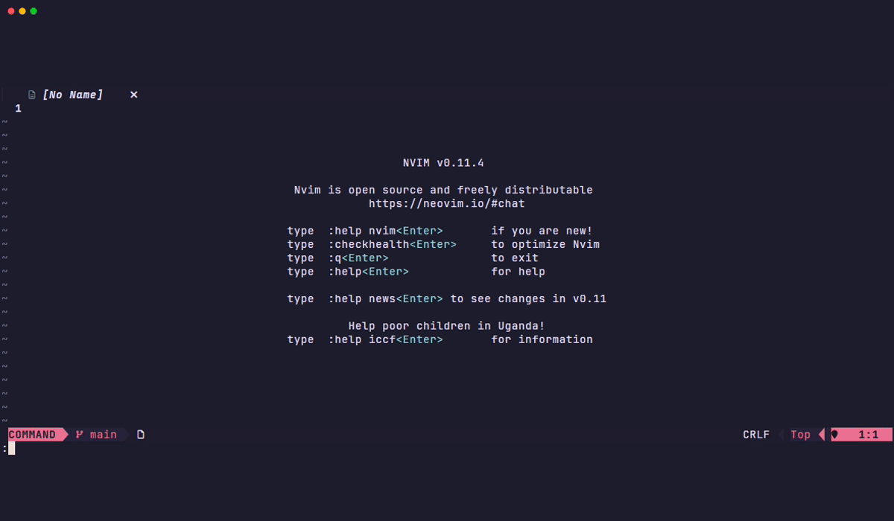
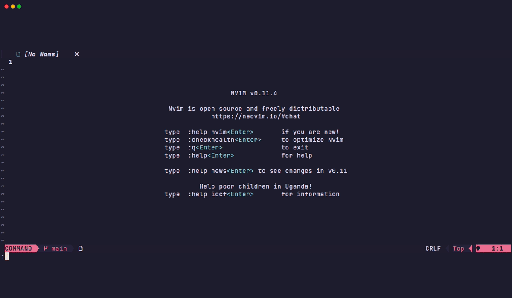
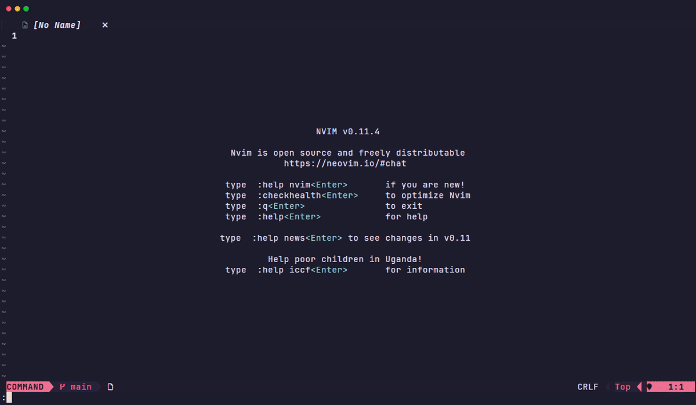

<div align="center">

# nvim-favdir

**Two-panel floating UI for managing favorite directories and files in Neovim**

[](https://neovim.io/)
[](https://www.lua.org/)
[](LICENSE)

[Features](#features) •
[Installation](#installation) •
[Quick Start](#quick-start) •
[Configuration](#configuration) •
[Keymaps](#keymaps) •
[API](#api)

</div>

---

## Demo

<p align="center">
  
</p>

---

## Features

<table>
<tr>
<td width="50%" valign="top">

### Core
- Hierarchical groups with nested subgroups
- Add favorite directories and files
- Directory links for filesystem browsing
- Persistent storage (JSON)
- Protected groups (prevent deletion)

### Two-Panel UI
- Left panel: Groups and directory links
- Right panel: Items or directory contents
- Tab/Shift-Tab panel navigation
- Cursor position persistence
- Configurable window dimensions

### Sorting
- Groups: Custom order, Alphabetical
- Items: Custom, Name, Created, Modified, Size, Type
- Toggle ascending/descending
- Manual reordering with Ctrl+K/J

</td>
<td width="50%" valign="top">

### File Operations
- Open files in current window
- Open in horizontal split (`<C-s>`)
- Open in vertical split (`|`)
- Open in new tab (`<C-t>`)
- cd into directories

### UI Polish
- Nerd Font icons with ASCII fallback
- nvim-web-devicons integration
- Expand/collapse group hierarchy
- State persistence across sessions

### Management
- Add, rename, delete groups
- Move items between groups
- Move groups to different parents
- Bulk operations via directory links

</td>
</tr>
</table>

---

## Requirements

<table>
<tr>
<td>

**Neovim 0.8+** (0.11+ recommended)

</td>
<td>

**[nvim-float](https://github.com/mikevskater/nvim-float)** (UI framework)

</td>
</tr>
</table>

<details>
<summary><b>Optional Dependencies</b></summary>

<br>

| Dependency | Purpose |
|:-----------|:--------|
| [nvim-web-devicons](https://github.com/nvim-tree/nvim-web-devicons) | Enhanced file type icons |
| [mini.icons](https://github.com/echasnovski/mini.icons) | Alternative icon provider |
| [Nerd Font](https://www.nerdfonts.com/) | Proper icon display in terminal |

</details>

---

## Installation

### lazy.nvim <sub>(Recommended)</sub>

```lua
{
  "mikevskater/nvim-favdir",
  dependencies = {
    "mikevskater/nvim-float",
    "nvim-tree/nvim-web-devicons", -- optional
  },
  cmd = { "FavdirOpen", "FavdirToggle", "FavdirAddDir", "FavdirAddFile" },
  keys = {
    { "<leader>ofd", "<cmd>FavdirOpen<cr>", desc = "Open favorite directories" },
  },
  opts = {
    -- Overrideable controls
    keymaps = {
      open = "<leader>ofd",
      confirm = "<CR>",
      expand_or_browse = "o",
      go_up = "<BS>",
      next_panel = "<Tab>",
      prev_panel = "<S-Tab>",
      add = "a",
      delete = "d",
      rename = "r",
      move = "m",
      move_group = "M",
      sort = "s",
      sort_order = "S",
      reorder_up = "<C-k>",
      reorder_down = "<C-j>",
      open_split = "<C-s>",
      open_vsplit = "|",
      open_tab = "<C-t>",
      close = "q",
      close_alt = "<Esc>",
    }
  },
}
```

<details>
<summary><b>Other Package Managers</b></summary>

<br>

**packer.nvim**
```lua
use {
  "mikevskater/nvim-favdir",
  requires = { "mikevskater/nvim-float" },
  config = function()
    require("nvim-favdir").setup()
  end
}
```

**vim-plug**
```vim
Plug 'mikevskater/nvim-float'
Plug 'mikevskater/nvim-favdir'

" After plug#end():
lua require('nvim-favdir').setup()
```

**mini.deps**
```lua
add({ source = "mikevskater/nvim-float" })
add({ source = "mikevskater/nvim-favdir" })
```

</details>

---

## Quick Start

<table>
<tr>
<td width="33%">

**Open the UI**

```lua
require("nvim-favdir").setup()

-- Then use:
-- :FavdirOpen
-- or <leader>ofd
```

</td>
<td width="33%">

**Add Favorites**

```lua
-- Add current directory
:FavdirAddDir

-- Add current file
:FavdirAddFile

-- Or press 'a' in the UI
```

</td>
<td width="33%">

**Navigate**

```
<Tab>     Switch panels
<CR>      Open/select
o         Expand/browse
<BS>      Go up folder
q         Close
```

</td>
</tr>
</table>

---

## Configuration

<details open>
<summary><b>Default Configuration</b></summary>

```lua
require('nvim-favdir').setup({
  -- File paths
  data_file = vim.fn.stdpath('data') .. '/favdirs.json',
  ui_state_file = vim.fn.stdpath('data') .. '/favdirs_ui_state.json',

  -- Window sizing (0.0 to 1.0)
  window_height_ratio = 0.7,      -- 70% of editor height
  window_width_ratio = 0.8,       -- 80% of editor width
  left_panel_width_ratio = 0.35,  -- 35% for groups panel

  -- Groups
  default_groups = {},            -- Groups created on first run
  protected_groups = {},          -- Groups that cannot be deleted

  -- Display
  use_nerd_font = true,           -- Auto-detected if available

  -- Debug
  debug_mode = false,
  log_to_file = false,
})
```

</details>

### Options Reference

| Option | Type | Default | Description |
|:-------|:-----|:--------|:------------|
| `data_file` | string | `~/.local/share/nvim/favdirs.json` | Path to data file |
| `ui_state_file` | string | `~/.local/share/nvim/favdirs_ui_state.json` | Path to UI state |
| `window_height_ratio` | number | `0.7` | Window height ratio |
| `window_width_ratio` | number | `0.8` | Window width ratio |
| `left_panel_width_ratio` | number | `0.35` | Left panel width ratio |
| `default_groups` | string[] | `{}` | Groups created on first run |
| `protected_groups` | string[] | `{}` | Groups that cannot be deleted |
| `use_nerd_font` | boolean | `true` | Use Nerd Font icons |
| `debug_mode` | boolean | `false` | Enable debug logging |

<details>
<summary><b>Example: Custom Groups</b></summary>

<br>

```lua
require('nvim-favdir').setup({
  default_groups = {
    "Work",
    "Work.Active",
    "Work.Archive",
    "Projects",
    "Config",
  },
  protected_groups = { "Work", "Config" },
})
```

</details>

<details>
<summary><b>Example: Custom Window Size</b></summary>

<br>

```lua
require('nvim-favdir').setup({
  window_height_ratio = 0.9,
  window_width_ratio = 0.95,
  left_panel_width_ratio = 0.4,
})
```

</details>

---

## Commands

| Command | Description |
|:--------|:------------|
| `:FavdirOpen` | Open the favorite directories UI |
| `:FavdirToggle` | Toggle the UI (open/close) |
| `:FavdirAddDir` | Add current working directory to favorites |
| `:FavdirAddFile` | Add current buffer's file to favorites |

---

## Keymaps

All keymaps are customizable via the `keymaps` option in setup.

<details open>
<summary><b>Navigation</b></summary>

| Key | Left Panel | Right Panel |
|:----|:-----------|:------------|
| `<CR>` | Select group | Open file / cd to dir |
| `<Tab>` | Switch to right panel | Switch to left panel |
| `<S-Tab>` | Switch to right panel | Switch to left panel |
| `o` | Expand/collapse group | Browse folder contents |
| `<BS>` | — | Go up folder level |

</details>

<details>
<summary><b>Actions</b></summary>

| Key | Left Panel | Right Panel |
|:----|:-----------|:------------|
| `a` | Add group or dir link | Add item to group |
| `d` | Delete group/dir link | Remove item |
| `r` | Rename group | — |
| `m` | — | Move item to group |
| `M` | Move group to parent | — |

<p align="center">
  
</p>

</details>

<details>
<summary><b>Sorting</b></summary>

| Key | Action |
|:----|:-------|
| `s` | Cycle sort mode |
| `S` | Toggle ascending/descending |
| `<C-k>` | Reorder item up |
| `<C-j>` | Reorder item down |

**Sort modes:**
- Groups: `custom` → `alpha`
- Items: `custom` → `name` → `created` → `modified` → `size` → `type`

<p align="center">
  
</p>

</details>

<details>
<summary><b>Opening (Right Panel)</b></summary>

| Key | Action |
|:----|:-------|
| `<C-s>` | Open in horizontal split |
| `\|` | Open in vertical split |
| `<C-t>` | Open in new tab |

</details>

<details>
<summary><b>Window</b></summary>

| Key | Action |
|:----|:-------|
| `q` | Close UI |
| `<Esc>` | Close UI |

</details>

<details>
<summary><b>Custom Keymaps</b></summary>

<br>

```lua
require('nvim-favdir').setup({
  keymaps = {
    open = "<leader>fd",    -- Change global keymap
    delete = "x",           -- Use 'x' instead of 'd'
    add = "n",              -- Use 'n' instead of 'a'
    close = "q",
    -- Set to false to disable
    close_alt = false,
  }
})
```

</details>

---

## API

```lua
local favdir = require('nvim-favdir')
```

| Function | Description |
|:---------|:------------|
| `favdir.setup(opts)` | Initialize with configuration |
| `favdir.show()` | Open the UI |
| `favdir.toggle()` | Toggle UI visibility |
| `favdir.add_cwd(group?)` | Add cwd to group (prompts if nil) |
| `favdir.add_file(group?)` | Add current file to group |
| `favdir.get_data()` | Get all data (groups, items) |
| `favdir.get_groups()` | Get list of group paths |

<details>
<summary><b>Usage Examples</b></summary>

<br>

```lua
-- Custom keymap
vim.keymap.set('n', '<leader>fd', require('nvim-favdir').toggle)

-- Add current directory to a specific group
vim.keymap.set('n', '<leader>fa', function()
  require('nvim-favdir').add_cwd("Work")
end)

-- List all groups
local groups = require('nvim-favdir').get_groups()
-- { "Work", "Work.Active", "Projects", ... }

-- Get all data for external use
local data = require('nvim-favdir').get_data()
for _, group in ipairs(data.groups) do
  print(group.name, #group.items .. " items")
end
```

</details>

> **Note:** See `:help favdir` for complete API documentation.

---

## Data Files

<table>
<tr>
<td width="50%" valign="top">

**Main Data** (`favdirs.json`)

```json
{
  "groups": [
    {
      "name": "Work",
      "order": 1,
      "items": [
        { "path": "/path/to/dir", "type": "dir", "order": 1 }
      ],
      "children": [],
      "dir_links": []
    }
  ]
}
```

</td>
<td width="50%" valign="top">

**UI State** (`favdirs_ui_state.json`)

```json
{
  "expanded_groups": ["Work"],
  "last_selected_group": "Work",
  "focused_panel": "left",
  "left_cursor": { "row": 1, "col": 0 },
  "right_cursor": { "row": 1, "col": 0 },
  "left_sort_mode": "custom",
  "right_sort_mode": "name"
}
```

</td>
</tr>
</table>

Run `:echo stdpath('data')` to see your data directory path.

---

## FAQ

<details>
<summary><b>Icons not displaying correctly?</b></summary>

<br>

Install a [Nerd Font](https://www.nerdfonts.com/) and set it in your terminal.

Popular choices: FiraCode, JetBrainsMono, Hack

</details>

<details>
<summary><b>How do I reset all data?</b></summary>

<br>

```bash
rm ~/.local/share/nvim/favdirs.json
rm ~/.local/share/nvim/favdirs_ui_state.json
```

Then restart Neovim.

</details>

<details>
<summary><b>How do I enable debug logging?</b></summary>

<br>

```lua
require('nvim-favdir').setup({
  debug_mode = true,
  log_to_file = true,  -- writes to ~/.local/share/nvim/favdir.log
})
```

</details>

<details>
<summary><b>How do nested groups work?</b></summary>

<br>

Use dot notation: `"Work.Projects.Active"` creates:

```
Work/
└── Projects/
    └── Active/
```

</details>

<details>
<summary><b>What are directory links?</b></summary>

<br>

Directory links let you browse a filesystem directory in the right panel without adding its contents as individual items. Useful for frequently accessed folders.

Press `a` in the left panel and choose "Directory Link" to create one.

</details>

---

## Contributing

Contributions are welcome! Please:

1. Fork the repository
2. Create a feature branch (`git checkout -b feature/amazing-feature`)
3. Make your changes
4. Commit your changes (`git commit -m 'Add amazing feature'`)
5. Push to the branch (`git push origin feature/amazing-feature`)
6. Open a Pull Request

---

## Issues

Found a bug or have a feature request? Please open an issue on [GitHub Issues](https://github.com/mikevskater/nvim-favdir/issues).

<table>
<tr>
<td>

**When opening an issue, please include:**

- **Bug or Feature** — Label your issue type
- **Description** — Clear description of the issue or feature
- **Steps to Reproduce** — Minimal steps to reproduce (for bugs)
- **Expected Behavior** — What you expected to happen

</td>
</tr>
</table>

---

<div align="center">

## License

MIT License — see [LICENSE](LICENSE) for details.

<br>

Made with Lua for Neovim

</div>
